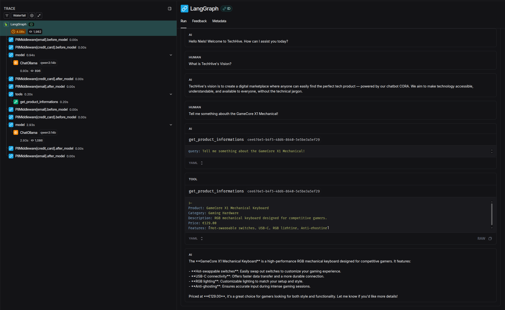

# CORA Customer Agent 🤖

<div align="center">

**An intelligent AI-powered customer support agent for enhanced e-commerce experiences**


</div>

---

## 🎯 Project Overview

**CORA (Customer-Oriented Responsive Assistant)** is a prototype AI agent designed for **TechHive**, a simulated e-commerce company specializing in smart home devices, gaming hardware, and computer technology. This project demonstrates how modern AI technologies can revolutionize customer service by automating repetitive inquiries, providing instant product information, and delivering personalized support experiences.

The goal is to improve customer satisfaction while reducing support team workload by intelligently handling common questions.

---

## ✨ Key Features

### 🧠 Agentic AI with LangChain & Ollama
- **Tool-Calling Agents** - Autonomous decision-making to route queries to appropriate data sources
- **Local LLM Inference** - Privacy-focused, cost-effective inference using Ollama
- **Flexible Model Support** - Compatible with any Ollama model that supports tool calling
- **Configurable Parameters** - Fine-tune temperature, top-p, top-k, and context windows

### 📚 Retrieval-Augmented Generation (RAG)
- **Vector Database** - ChromaDB stores vectorized company FAQs and product catalogs
- **Semantic Search** - Retrieves relevant information based on query similarity
- **Dual Knowledge Bases** - Separate collections for FAQ and product information
- **Threshold-Based Filtering** - Only returns results exceeding configurable relevance scores

### 🔌 Model Context Protocol (MCP)
- **FastMCP Server** - Exposes two tools for FAQ and product information retrieval
- **Async Tool Execution** - Non-blocking operations for efficient query handling
- **Standardized Interface** - Clean separation between agent logic and data access

### 🛡 Agent Middleware
- **PII Protection** - Automatically redacts emails and masks credit card numbers
- **Dynamic System Prompts** - Personalized greetings addressing users by name for engaging experiences

### 💾 Conversational Memory
- **In-Memory State** - Maintains conversation history within sessions
- **Thread-Based Persistence** - Tracks multi-turn conversations with thread IDs

### 🎨 Simple Gradio Frontend
- **Chat Interface** - Clean, intuitive UI for interacting with CORA
- **Streaming Responses** - Token-by-token output for responsive user experience

### ⚡ Redis Semantic Cache
- **Query Caching** - Stores responses to semantically similar questions
- **Reduced Latency** - Instant responses for cached queries
- **Cost Optimization** - Minimizes LLM inference calls
- **TTL Management** - Automatic cache expiration after configurable time periods

---

## 🎬 Demo

The following demo showcases CORA's key capabilities:

https://github.com/user-attachments/assets/153ed9e6-e92c-4080-a221-eba696d828c2

**Note:** If the video doesn't display correctly in your browser, you can download `chatbot_demo.mov` from the repository root directory.

**Demo Highlights:**
- **Left Panel:** Gradio chat interface where users interact with CORA
- **Right Panel:** Terminal displaying the MCP server logs in real-time
- **Message 1:** _"Hello"_ - Personalized greeting using dynamic system prompt
- **Message 2:** _"Tell me about the HiveSmart Light Bulb A60"_ - Demonstrates MCP tool calling (`get_product_informations`) visible in the terminal
- **Message 3:** _"What was my first message to you?"_ - Showcases conversational memory with full chat context retention
- **Message 4:** _"Tell me about the HiveSmart Light Bulb A60"_ - Illustrates Redis semantic cache hit for instant response

---

## 🚀 Quick Start

### Prerequisites

Before starting, ensure you have the following installed:

1. **[UV Package Manager](https://docs.astral.sh/uv/)** - Modern Python package manager
2. **[Docker & Docker Compose](https://docs.docker.com/get-docker/)** - For ChromaDB and Redis services
3. **[Ollama](https://ollama.com/download)** - Local LLM inference engine

### Ollama Model Setup

⚠️ **Important:** CORA requires a model that supports **tool calling**. The default configuration uses `qwen3:14b`.

**Pull the model:**
```bash
# Pull the default model (recommended)
ollama pull qwen3:14b
```

Browse all tool-capable models: **[Ollama Tool-Capable Models](https://ollama.com/search?c=tools)**

**Changing the model:**
Edit `src/cora_customer_agent/cora_config.yaml`:
```yaml
ollama_config:
  model: "qwen3:14b"  # Change this when using a different model
```

⚠️ **Performance Note:** Models with fewer parameters (e.g., `llama3.2:1b`) may produce inconsistent or lower-quality responses.

---

### Installation Steps

#### 1. Clone the Repository
```bash
git clone git@github.com:niels-2005/cora_customer_agent.git
cd cora_customer_agent
```

#### 2. Create Virtual Environment
```bash
# Create virtual environment with uv
uv venv

# Activate the virtual environment
# On Linux/macOS:
source .venv/bin/activate

# On Windows:
.venv\Scripts\activate

# Install dependencies
uv sync
```

#### 3. Start Docker Services
```bash
# Start ChromaDB and Redis
docker-compose up -d
```

#### 4. Configure the Application (Optional)

📋 **Review the configuration file:**  
Most settings are pre-configured and work out of the box. However, it's recommended to review `src/cora_customer_agent/cora_config.yaml` to understand the customization options.

**Key configuration sections:**
- **MCP Server** - Port and host settings
- **Vector Database** - Collection names, paths, and initialization flags
- **Embedding Model** - HuggingFace model selection
- **Semantic Cache** - Redis connection and similarity thresholds
- **Ollama LLM** - Model selection and inference parameters

⚠️ **First-Time Setup:** If running for the first time, set `init_vector_store: true` (default) in the config to populate ChromaDB with documents. After the first run, set it back to `false` to avoid re-initialization.

---

### Running the Application

#### Start the MCP Server
```bash
# Start the MCP Server
run_mcp
```

#### Start the Gradio Frontend (in a new terminal)
```bash
# Start the Gradio interface, the MCP server needs to be running first to avoid connection errors
run_gradio
```

---

## 🌐 Access Points

| Service | URL | Description |
|---------|-----|--------------|
| **Gradio Chat UI** | http://127.0.0.1:7860 | Interactive chatbot interface |
| **MCP Server** | http://127.0.0.1:8080 | Tool server for agent (no UI) |
| **ChromaDB** | http://127.0.0.1:8000 | Vector database (no UI) |
| **Redis** | http://127.0.0.1:6379 | Semantic cache (no UI) |

---

## 🧪 Testing the Agent

You can find the simulated company data in `src/cora_customer_agent/company_docs`

Once both services are running, try these example queries in the Gradio interface:

**FAQ Questions:**
- "How long does delivery take?"
- "How secure are my payment details?"

**Product Questions:**
- "Tell me about the HiveSmart Light Bulb A60"
- "Show me details about the HiveCam 360 Pro"

**Conversational Memory:**
- "How long does delivery take?"
- "What was my first message?" (tests memory)

---

## 📊 Optional: LangSmith Integration

Enable distributed tracing and debugging with [LangSmith](https://docs.langchain.com/langsmith/home) for advanced observability.

**Features:**
- 📈 Trace agent decisions and tool calls
- 🐛 Debug chain execution step-by-step
- ⏱️ Measure latency for each component
- 💰 **Free tier:** 5,000 traces per month

### Setup Instructions

1. **Create LangSmith Account**  
   Sign up at https://smith.langchain.com

2. **Generate API Key**  
   Navigate to Settings → API Keys → Create New Key

3. **Configure Environment Variables**
   ```bash
   # Copy the example file
   cp .env.example .env
   
   # Edit .env and add your key
   ```

4. **Restart the Application**
   ```bash
   # Restart Gradio frontend to load environment variables
   run_gradio
   ```

Traces will now appear in your LangSmith dashboard at https://smith.langchain.com

Example trace:


---

## 🚧 Future Improvements

Since November 13, 2025, this project is no longer actively developed. However, if I were to continue its evolution, I would focus on the following enhancements:

- **PostgreSQL Integration** - Implement persistent conversation history and user accounts (currently in-memory state lost on restart)
- **Authentication System** - Add user login and personalized chat history (currently single-user frontend)
- **Reasoning Display in UI** - Show agent reasoning steps in the frontend for transparency (currently hidden when reasoning is enabled)
- **Automated Model Management** - Implement automatic Ollama model download and version management (currently manual)
- **Semantic Cache Optimization** - Fix personalization issue where cached responses contain wrong user names due to dynamic system prompts. Solutions: user-specific cache keys (expensive) or exclude personalized responses.
- **Dynamic RAG Parameters** - Allow agent to dynamically determine document retrieval count based on query complexity with bounded limits (min=1, max=10) and embedding-based reranker. Currently hardcoded (`k=1`, threshold=`0.4`)
- **AI-as-a-Judge Evaluation Framework** - Implement comprehensive evaluation including agent workflow analysis, input/output comparison against reference outputs, RAG retrieval quality assessment, and edge case testing (non-existent products, ambiguous queries). Resources: [LangSmith Documentation](https://docs.smith.langchain.com), [openevals](https://github.com/langchain-ai/openevals), and [agentevals](https://github.com/langchain-ai/agentevals) repositories. Not implemented due to hardware limitations
- **Model & Embedding Experimentation** - Systematic testing with different embedding models and LLMs to optimize performance (hardware constraints prevented comprehensive testing)
- **LLM Fine-tuning** - Fine-tune models using libraries like Transformers (with QLoRA) to eliminate RAG components and reduce inference time. Trade-offs: Fine-tuning is expensive and requires retraining when new products/FAQs are added. For this use case, RAG is prioritized over fine-tuning due to flexibility and maintainability
- **Migrate from Ollama to vLLM** - vLLM is optimized for inference performance. Experiment with prefix caching, speculative decoding, and other advanced caching mechanisms for improved throughput and reduced latency
- **Langfuse Integration** - For fully open-source observability, consider [Langfuse](https://langfuse.com) as an alternative to LangSmith (SaaS) for self-hosted tracing, evaluation, and prompt management
- **Context Window Handling** - Implement intelligent token usage monitoring with summarization middleware at ~80-90% capacity to preserve critical information while staying within model constraints
- **Enhanced MCP Tools** - Extend the MCP server with product recommendation engine, order tracking integration, personalized suggestions based on user history, and smart home device compatibility checker
- **User Profile Management MCP Server** - Separate MCP server (separation of concerns) for updating personal information (address, preferences) via chatbot.Requires careful evaluation and introduces security risks that must be thoroughly addressed
- **Voice Interface** - Speech-to-text and text-to-speech capabilities for accessibility
- **Image Support** - Visual product catalogs with image embeddings for multimodal interactions
- **Feedback Loop** - User ratings to improve responses over time 
- **API-Based Model Inference** - Consider hosted APIs (OpenAI, Anthropic) for improved performance, access to frontier models, and reduced infrastructure overhead. <br>
  ⚠️ **Critical:** Ensure no sensitive customer data (PII, payment info, personal details) is sent to external APIs through strict data filtering and anonymization
- **And probably much more!**

---

## 📝 License

This project is licensed under the MIT License - see the LICENSE file for details.

This README.md file was written by AI but strictly followed by human review and edits.

---

<div align="center">

**⭐ If you find this project useful, consider giving it a star on GitHub! ⭐**

</div>
